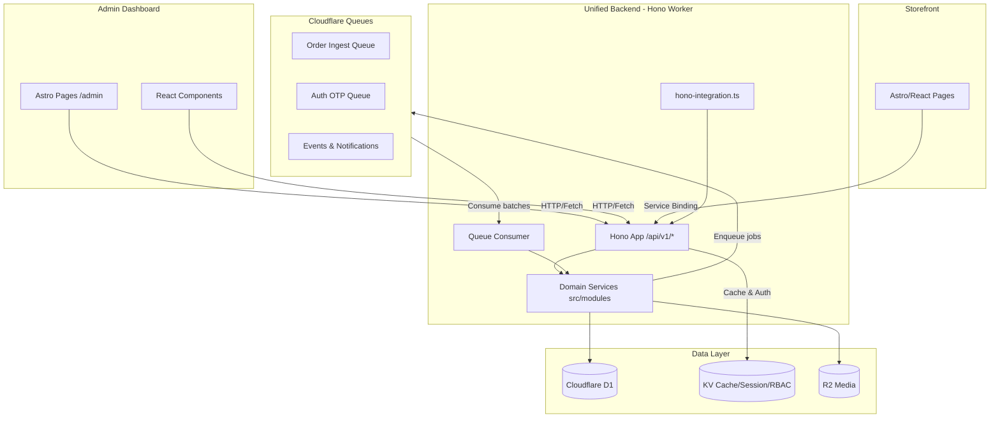

<p align="center">
  <a href="https://scalius.com">
    
  </a>
</p>

<h1 align="center">
  Scalius Commerce Lite
</h1>

<h4 align="center">
  <a href="https://docs.scalius.com">Documentation</a> |
  <a href="https://scalius.com">Website</a>
</h4>

<p align="center">
  Full-stack e-commerce admin dashboard + storefront API built on Astro, Hono, and Cloudflare D1.
</p>

<p align="center">
  <!-- License: AGPL v3 -->
  <a href="https://github.com/scaliuslabs/scalius-commerce-lite/blob/master/LICENSE">
    
  </a>
  <!-- PRs Welcome -->
  <a href="https://github.com/scaliuslabs/scalius-commerce-lite/blob/master/CONTRIBUTING.md">
    
  </a>
  <!-- Security Policy -->
  <a href="https://github.com/scaliuslabs/scalius-commerce-lite/blob/master/SECURITY.md">
    
  </a>
</p>

<p align="center">
  <!-- Twitter / X -->
  <a href="https://scalius.com/x">
    
  </a>
  <!-- Discord -->
  <a href="https://scalius.com/discord">
    
  </a>
  <!-- Facebook -->
  <a href="https://scalius.com/facebook">
    
  </a>
</p>

## Get Started

Scalius Commerce Lite is a full-stack **e-commerce admin dashboard** + **storefront API** built on **Astro** and **Hono**, backed by **Cloudflare D1** (SQLite) via **Drizzle ORM**. The admin side ships as Astro pages with React components; the storefront API ships as a Hono app mounted under `/api/v1`.

### What's in this repo

- **Admin dashboard (UI)**: `src/pages/admin/**` (Astro pages) + `src/components/admin/**` (React components).
- **Backend API (Unified Hono)**: `src/server/**` (Hono app + routes), mounted at `/api/v1/**` via the custom Astro integration in `src/integrations/hono-integration.ts`. Handles both Admin CRUD operations (`/api/v1/admin/**`) and Storefront endpoints.
- **Domain Modules**: `src/modules/**` - Domain-Driven Design service classes containing the core business logic, decoupled from the HTTP routing layer.
- **Database (Drizzle + D1)**: schema split across 11 domain files in `src/db/schema/` (barrel: `src/db/schema/index.ts`), connection in `src/db/index.ts`, migrations in `migrations/**`.

### Key URLs

- **Admin UI**: `/admin`
- **Unified API (Hono)**: `/api/v1/**` (Includes `/api/v1/admin/**` for dashboard operations)
- **Swagger UI**: `/api/v1/docs`
- **OpenAPI JSON**: `/api/v1/openapi.json`
- **Health**: `/health` (Astro) and `/api/v1/health` (Hono)

### Tech stack

- **Runtime / framework**: Astro 6 (SSR, Cloudflare adapter, Experimental Rust Compiler) + Vite 7 + React
- **Storefront API**: Hono (Swagger UI + OpenAPI)
- **Database**: Cloudflare D1 (SQLite) + Drizzle ORM + FTS5 full-text search
- **UI**: Tailwind CSS v4 + shadcn/ui (`src/components/ui/**`)
- **Auth**: Better Auth (email/password + optional admin 2FA with TOTP/email OTP)
- **Caching**: Cloudflare KV (with in-memory fallback) for Hono API response caching
- **Storage**: Cloudflare R2 for media uploads
- **Notifications**: Firebase Cloud Messaging (admin push notifications, configured via dashboard)
- **Email**: Resend API (2FA codes, password reset, configured via dashboard)
- **AI tooling**: OpenRouter integration for widget/content generation (API key stored in DB settings)
- **Deploy**: Cloudflare Workers via Wrangler

### Features (high level)

- **Commerce**: products (including variants, images, rich content), categories, attributes, collections
- **Sales**: orders, customers, abandoned checkouts, discounts
- **Storefront content**: header/footer builders, navigation, pages, hero sliders, widgets
- **Operations**: shipping methods, delivery providers/shipments, fraud checker, cache management
- **Media**: R2-backed uploads + Cloudflare Image Resizing optimization in production
- **Notifications**: admin push notifications for new orders (Firebase Cloud Messaging)
- **AI**: OpenRouter-powered widget/content generation and prompt tooling
- **Security**: optional admin 2FA (authenticator app or email OTP), rate limiting, secure sessions

### Architecture overview



#### Admin (Astro pages + React)

- Admin pages live in `src/pages/admin/**` and render through `src/layouts/AdminLayout.astro`.
- Most interactive UI is React (hydrated with `client:*` directives).
- Authentication and incredibly fast KV-backed RBAC caching are enforced by `src/middleware.ts` before pages render.

#### Unified API + Domain Modules (Hono)

- Hono app entry: `src/server/index.ts`
- Astro integration injects `/api/v1/[...slug]` and forwards requests to Hono via `src/server/astro-handler.ts`.
- The HTTP routing layer (`src/server/routes/**`) is kept extremely thin. It handles request validation, auth checks, and immediately delegates to Domain Services.
- **Domain-Driven Design (DDD)**: Actual business logic lives in `src/modules/**` (e.g., `products.service.ts`, `orders.service.ts`). These services expect a D1 database instance injection, making them highly testable, modular, and LLM-friendly.
- Admin APIs live at `/api/v1/admin/**` and storefront APIs live elsewhere under `/api/v1/`.
- API docs:
  - Swagger UI is served at `/api/v1/docs`
  - OpenAPI spec is served at `/api/v1/openapi.json`

### Project structure (high level)

```text
src/
  pages/
    admin/               # Admin dashboard pages (Astro)
    auth/                # Auth pages (login, setup, 2FA)
    health.ts
  components/
    admin/               # Admin React components
    auth/                # Auth React components
    ui/                  # shadcn/ui components
  server/
    index.ts             # Hono app (Unified API initialization)
    astro-handler.ts     # Astro → Hono bridge for /api/v1/*
    routes/              # Hono route modules (thin HTTP layer)
      admin/             # Admin API endpoints
      ...                # Storefront API endpoints
    middleware/          # Hono middleware (auth + caching)
    openapi/             # OpenAPI spec builder
    utils/               # KV cache / JWT helpers
  modules/               # Domain business logic (DDD)
    ai/                  # AI config, prompt helpers, context schema
    analytics/           # Dashboard stats service
    delivery/            # Delivery service, factory, providers, tracking
    inventory/           # Stock reserve/deduct/release/alerts
    marketing/           # Discounts service
    orders/              # Orders service
    payments/            # Stripe, SSLCommerz, Polar, COD, refunds
    products/            # Products service
  integrations/          # Third-party service integrations
    firebase/            # Firebase Admin + client
    meta/                # Meta Conversions API
    analytics.ts         # Analytics tracking
    email.ts             # Resend email
    storage.ts           # Cloudflare R2 uploads
  shared/                # Pure utility functions (no DB, no side effects)
    utils.ts             # cn(), date helpers, etc.
    currency.ts          # Currency formatting
    cors-helper.ts       # CORS origin helpers
    rate-limit.ts        # Rate limiting
    error-utils.ts       # Error formatting
    storefront-url.ts    # URL builders
    image-optimizer.ts   # Cloudflare Image Resizing
    # … and more (tag-parser, json-repair, html-section-parser, etc.)
  lib/                   # Auth + RBAC + search (remain here by design)
    auth.ts              # Better Auth configuration
    auth-client.ts       # Better Auth client for React
    rbac/                # RBAC helpers, permissions, page guards
    search/              # FTS5 query helpers
    middleware-helper/   # CSP + Hono cache invalidator
    fraud-checker/       # Fraud detection service
    notification-utils.ts
    delivery-locations.ts
    adminBreadCrumb.ts
  db/
    schema/              # Drizzle schema split by domain (11 files)
      index.ts           # Barrel — re-exports all 11 domain files
      enums.ts           # Shared const enums
      auth.ts            # user, session, account, verification, twoFactor
      rbac.ts            # permissions, roles, userRoles
      products.ts        # products, variants, images, categories…
      customers.ts
      orders.ts          # orders, orderItems, payments, codTracking…
      inventory.ts       # movements, lowStockAlerts
      delivery.ts        # deliveryProviders, deliveryShipments
      marketing.ts       # discounts, discountUsage, metaConversions
      content.ts         # pages, widgets, heroSliders
      system.ts          # settings, siteSettings, shippingMethods…
    index.ts             # getDb() (Cloudflare D1)
migrations/              # Drizzle migration SQL + snapshots
scripts/                 # Build and deployment scripts
```

### Scripts

From `package.json`:

```bash
pnpm dev:setup        # install deps, create .dev.vars + .env.development, apply local D1 migrations
pnpm dev              # astro dev --host (primary local dev flow)
pnpm start            # wrangler dev against built output
pnpm build            # astro check + astro build + drizzle-kit generate
pnpm deploy           # node scripts/deploy.mjs (build + migrate + deploy)

pnpm db:generate      # drizzle-kit generate
pnpm db:migrate:local # node scripts/deploy.mjs --migrate-only --local
pnpm db:migrate:remote # node scripts/deploy.mjs --migrate-only
pnpm dev:reset        # wipe .wrangler/state and re-apply local migrations
pnpm db:studio        # drizzle-kit studio

pnpm generate:sdk     # tsx src/scripts/generate-openapi-json.ts && openapi-ts
```

The deployable Worker entry point is `./src/worker.ts` (set in `wrangler.jsonc` `main`). `pnpm build` also runs `drizzle-kit generate`, so it may create new migration files when schema changes are detected.

### Environment variables

This project has three configuration surfaces:

1. **Cloudflare bindings in `wrangler.jsonc`** for D1, KV, R2, Queues, and non-secret runtime vars.
2. **Local env files**:
   - `.dev.vars` for Worker runtime secrets and local URL overrides.
   - `.env.development` for Vite/Astro build-time vars (`import.meta.env.*`).
3. **Admin dashboard settings** for third-party providers such as Resend, Firebase, payment gateways, delivery providers, and OpenRouter.

`pnpm dev:setup` creates both local files automatically. For manual setup, use `.dev.vars.example` as the runtime template and `.env.example` as the build-time template.

`wrangler.jsonc` in this repo already contains concrete worker/resource names and production URLs. Update those bindings and `vars` before deploying your own fork.

#### Runtime secrets and local overrides (`.dev.vars`)

Required:

- `BETTER_AUTH_SECRET`: Better Auth secret.
- `JWT_SECRET`: JWT signing secret for protected API flows.
- `API_TOKEN`: machine-to-machine token used by `/api/v1/auth/token`.
- `BETTER_AUTH_URL`: auth callback origin. Local default: `http://localhost:4321`.
- `PUBLIC_API_BASE_URL`: canonical admin/API origin. Local default: `http://localhost:4321`.
- `STOREFRONT_URL`: storefront origin used by redirects and payment callbacks. Local default: `http://localhost:4322`.

Optional runtime vars:

- `R2_PUBLIC_URL`: public base URL for uploaded media.
- `CDN_DOMAIN_URL`: CDN/image allow-list domain for CSP and Astro image config.
- `PURGE_URL`: external storefront purge endpoint.
- `PURGE_TOKEN`: bearer token/header secret used with `PURGE_URL`.
- `PROJECT_CACHE_PREFIX`: KV namespace prefix. Defaults to `sc`.
- `CSP_ALLOWED`: comma-separated extra domains for CSP/CORS allow-lists.
- `FIREBASE_SERVICE_ACCOUNT_CRED_JSON`: optional Firebase Admin fallback when dashboard settings are not configured.

#### Build-time vars (`.env.development`)

Required in practice for local admin auth:

- `PUBLIC_API_BASE_URL`: consumed by the Better Auth React client.

Optional build-time/public vars:

- `PUBLIC_FIREBASE_API_KEY`
- `PUBLIC_FIREBASE_AUTH_DOMAIN`
- `PUBLIC_FIREBASE_PROJECT_ID`
- `PUBLIC_FIREBASE_STORAGE_BUCKET`
- `PUBLIC_FIREBASE_MESSAGING_SENDER_ID`
- `PUBLIC_FIREBASE_APP_ID`
- `PUBLIC_FIREBASE_MEASUREMENT_ID`
- `OPENROUTER_BASE_URL`
- `PUBLIC_SITE_URL`
- `SITE_TITLE`

#### Dashboard-configured integrations

These are configured from the admin dashboard and stored in the database, not in env vars:

| Integration                                           | Where to configure                |
| ----------------------------------------------------- | --------------------------------- |
| Resend email key + sender                             | **Settings → Email**              |
| Firebase public config + service account              | **Settings → Notifications**      |
| Stripe / SSLCommerz / Polar + enabled payment methods | **Settings → Payments**           |
| Delivery provider credentials/config                  | **Settings → Delivery Providers** |
| OpenRouter API key                                    | widget generator settings dialog  |

Development note: if Resend is not configured in the dashboard, transactional emails are logged to the console instead of being sent.

### Cloudflare bindings

The following bindings are declared in `wrangler.jsonc` and are automatically available to the Worker at runtime. No environment variables are needed for these — they are injected by the Cloudflare Workers runtime:

| Binding                     | Type        | Purpose                                                   |
| --------------------------- | ----------- | --------------------------------------------------------- |
| `DB`                        | D1Database  | Primary SQLite database                                   |
| `CACHE`                     | KVNamespace | API response cache                                        |
| `SESSION`                   | KVNamespace | Astro session storage                                     |
| `SHARED_AUTH_CACHE`         | KVNamespace | Firebase access token cache                               |
| `BUCKET`                    | R2Bucket    | Media file storage                                        |
| `PAYMENT_EVENTS_QUEUE`      | Queue       | Payment event processing (producer)                       |
| `ORDER_NOTIFICATIONS_QUEUE` | Queue       | Order notification processing (producer)                  |
| `AUTH_OTP_QUEUE`            | Queue       | Async email/OTP delivery (producer/consumer)              |
| `ORDER_INGEST_QUEUE`        | Queue       | High-concurrency async order creation (producer/consumer) |
| `ASSETS`                    | Fetcher     | Static asset serving                                      |

### Local development

#### 1) First-time setup

```bash
pnpm dev:setup
```

This command:

- installs dependencies
- creates `.dev.vars`
- creates `.env.development`
- applies local D1 migrations

#### 2) Start the app

```bash
pnpm dev
```

`astro dev` is the primary local workflow. The Cloudflare adapter is configured with `platformProxy`, so D1/KV/R2 bindings are already emulated during `pnpm dev`.

#### 3) Create the first admin account

Visit `/admin`. If no admin exists yet, middleware redirects to `/auth/setup`, where the first account is created as an admin, marked as super admin, and the RBAC seed runs automatically.

#### 4) Useful local reset commands

```bash
pnpm dev:reset
pnpm db:migrate:local
```

- `pnpm dev:reset` wipes `.wrangler/state` and reapplies all migrations from scratch.
- `pnpm db:migrate:local` applies pending migrations without wiping data.

#### 5) Built-worker parity mode

```bash
pnpm build
pnpm start
```

Use this when you specifically want to run the built Worker via `wrangler dev`. `pnpm start` expects the built configurations.

Port note: auth callbacks assume the admin app is running on `http://localhost:4321`. If that port is occupied, stop the previous dev server before starting a new one.

### Database & migrations (Drizzle + Cloudflare D1)

- Drizzle config: `drizzle.config.ts`
- Schema: `src/db/schema/` (11 domain files, barrel at `src/db/schema/index.ts`)
- Migrations: `migrations/**`

Recommended workflow:

```bash
pnpm db:generate        # generate migration from schema changes
pnpm db:migrate:local   # apply migrations to local D1 (via wrangler)
pnpm db:migrate:remote  # apply migrations to remote D1
```

The deploy script (`scripts/deploy.mjs`) handles migrations automatically when running `pnpm deploy`.

### Full-text search (FTS5)

All text search (admin dashboard, storefront API, command palette) uses **SQLite FTS5** for fast, indexed full-text search instead of `LIKE '%term%'` scans.

- **FTS5 tables**: `products_fts`, `product_variants_fts`, `categories_fts`, `pages_fts`, `orders_fts`, `customers_fts`, `discounts_fts`, `abandoned_checkouts_fts`
- **External content**: Each FTS5 table is linked to its source table via `content=` / `content_rowid='rowid'`, so no data is duplicated — only the search index is stored.
- **Auto-sync**: INSERT/UPDATE/DELETE triggers keep FTS5 indexes in sync automatically.
- **Query features**: Prefix matching (typing "shi" matches "shirt"), multi-word AND queries ("blue shirt" requires both words), all via the shared helper in `src/lib/search/fts5.ts`. (FTS5 helpers remain in `src/lib/search/` — they are framework-level infrastructure, not domain logic.)
- **Migration**: `migrations/0016_fts5_search.sql`

### Authentication

This project uses [Better Auth](https://better-auth.com) for authentication with the following features:

- **Email/password authentication** with secure password hashing
- **Admin 2FA support**:
  - Authenticator app (TOTP)
  - Email OTP (requires Resend configured in the dashboard)
  - Backup codes
- **Rate limiting** on login, 2FA, and password reset flows
- **Session management** with 7-day expiry and automatic refresh

2FA is enforced only for users who have enabled it. Middleware redirects to `/auth/two-factor` when `twoFactorEnabled` is true and the current session is not yet verified.

#### First-time setup

1. Navigate to `/admin` (redirects to `/auth/setup` when no admin exists)
2. Create the first admin account with email and password
3. The account is promoted to super admin and RBAC roles/permissions are seeded automatically
4. Access the admin dashboard
5. Enable 2FA later from account settings if desired

#### Subsequent logins

1. Enter email and password at `/auth/login`
2. Complete 2FA verification only if the account has 2FA enabled
3. Access the admin dashboard

### API usage

Most application APIs now live in the unified Hono app under `/api/v1/`. The main exception is Better Auth, which still uses the Astro endpoint at `src/pages/api/auth/[...all].ts`.

#### Unified Hono API — `/api/v1/**`

- **Source Code**: `src/server/routes/**` (HTTP layer) delegating to `src/modules/**` (Business Logic)
- **Docs**: `/api/v1/docs` and `/api/v1/openapi.json`
- **CORS**: configured in `src/server/index.ts` using `src/shared/cors-helper.ts`
- **Caching**: many GET routes use `cacheMiddleware` (`src/server/middleware/cache.ts`) for extremely low latency.
- **Namespacing**:
  - **Admin Restricted routes (JWT/Session + RBAC required)**: `/api/v1/admin/**` (e.g., managing inventory, products, orders).
  - **Storefront Protected routes (JWT required)**: `/api/v1/orders/**` and `/api/v1/cache/**`
  - **Storefront Public routes (No JWT)**: most read-only storefront data under `/api/v1/` (e.g., standard product fetching, categories, layout data).

##### Storefront "single-call" endpoints

To reduce client round-trips, the Hono API exposes consolidated endpoints:

- `GET /api/v1/storefront/homepage`: homepage data (hero sliders, widgets, collections + products, SEO)
- `GET /api/v1/storefront/layout`: layout data (header/footer config, navigation fallback, analytics scripts)

##### Machine-to-machine auth (for protected routes)

Some routes (notably `/api/v1/orders/*` and `/api/v1/cache/*`) require a short-lived JWT.

1. Obtain a JWT using your `API_TOKEN`:

```bash
curl -sS \
  -H "X-API-Token: $API_TOKEN" \
  "http://localhost:4321/api/v1/auth/token"
```

2. Use the JWT to call protected endpoints:

```bash
curl -sS \
  -H "Authorization: Bearer <JWT_FROM_STEP_1>" \
  "http://localhost:4321/api/v1/cache/stats"
```

### Cache invalidation (how freshness is maintained)

There are two complementary mechanisms:

- **Module-level invalidation**: Domain services (`src/modules/**`) can invalidate specific cache keys after successful write operations.
- **Middleware-level invalidation**: `src/lib/middleware-helper/hono-cache-invalidator.ts` watches successful writes to admin endpoints (like `/api/v1/admin/products`, `/api/v1/admin/categories`, etc.) and triggers:
  - backend KV cache invalidation
  - optional external storefront purge (if `PURGE_URL` + `PURGE_TOKEN` are set)

In Cloudflare Workers, invalidations are scheduled via `ctx.waitUntil()` when available to prevent blocking the response.

### Media uploads (R2)

- Upload endpoint: `POST /api/v1/admin/media/upload` (multipart form field `files`)
- Storage implementation: `src/integrations/storage.ts` (native R2 bucket binding)
- The R2 bucket binding (`BUCKET`) is declared in `wrangler.jsonc`

Set `R2_PUBLIC_URL` to the public base URL of your own bucket/domain.

### Admin push notifications (FCM)

Firebase Cloud Messaging is configured primarily via the admin dashboard at **Settings → Notifications**.

To set up notifications:

1. Create a Firebase project at [console.firebase.google.com](https://console.firebase.google.com)
2. Enable Cloud Messaging in your Firebase project
3. Go to **Settings → Notifications** in the admin dashboard
4. Enter your Firebase configuration (API key, project ID, etc.)
5. Enter your service account credentials for server-side messaging

Fallbacks:

- `FIREBASE_SERVICE_ACCOUNT_CRED_JSON` can be used when the dashboard service account is not configured yet.
- `PUBLIC_FIREBASE_*` values can seed the service worker config when the dashboard public config is empty.

Implementation details:

- Client initializes FCM inside `src/layouts/AdminLayout.astro` and posts tokens to `POST /api/v1/admin/fcm-token`
- Server sends order notifications in the background from Hono order creation via `src/lib/notification-utils.ts`
- Firebase admin/client SDK: `src/integrations/firebase/`

### AI generation (OpenRouter)

- API key management: `GET/POST /api/v1/admin/settings/openrouter` (stored in DB settings, masked on read)
- Model list: `GET /api/v1/admin/openrouter/models`
- Generation: `POST /api/v1/admin/openrouter/generate`
- Staged generation: `POST /api/v1/admin/openrouter/generate-staged`
- System prompt fetch: `GET /api/v1/admin/ai-prompts?type=widget|landing-page|collection`

### SDK generation

This repo can generate a typed TS client from the Hono OpenAPI spec:

```bash
pnpm generate:sdk
```

The storefront (`scalius-commerce-storefront`) currently uses direct `fetch` calls via `createApiUrl` in `src/lib/api/` and does not use this SDK. The SDK is available for future use or external integrations.

See `src/lib/sdk/README.md` for usage patterns and security notes.

### Queues

The backend uses Cloudflare Queues for async processing:

- **`payment-events`**: Payment gateway webhook events (Stripe, SSLCommerz, etc.)
- **`order-notifications`**: Order notifications (e.g. push notifications for new orders)
- **`auth-otp`**: Async block-free delivery for authentication OTP emails
- **`order-ingest`**: High-concurrency order creation with D1 batched inventory reservations to prevent lockups

The deployable Cloudflare Worker entrypoint is located at `src/worker.ts`, which natively supports both HTTP request handling via Astro and a `queue` batch handler. Queue bindings are declared in `wrangler.jsonc`.

### Deployment (Cloudflare Workers)

- Build output is SSR (`output: "server"`) with the Cloudflare adapter (`astro.config.mjs`).
- Deploy with:

```bash
pnpm deploy
```

This runs `scripts/deploy.mjs` which handles building, migrations, and deploying to Cloudflare Workers via Wrangler.

`wrangler.jsonc` defines the main entry (`./src/worker.ts`), worker compatibility flags, D1/KV/R2/Queue bindings, and static assets binding.

### Maintenance notes

- **`/api/v1/auth/test`**: Debug endpoint in `src/server/routes/auth.ts`; consider removing for production.
- **OpenAPI spec**: Manually maintained in `src/server/openapi/`; may not match all Hono routes.

### Troubleshooting

- **"CRITICAL SECURITY ERROR: Using default JWT secret in production"**
  - Set `JWT_SECRET` in production.
- **"BETTER_AUTH_SECRET is not set"**
  - Set `BETTER_AUTH_SECRET` environment variable. Generate with: `openssl rand -base64 32`
- **Local auth callbacks or sign-in loops**
  - Make sure the dev server is running on `http://localhost:4321`.
  - Regenerate local files with `pnpm dev:setup -- --force` if your local URLs drifted.
- **KV cache not working**
  - Ensure the `CACHE` KV namespace is correctly bound in `wrangler.jsonc` and created in your Cloudflare account.
- **CORS issues**
  - Set `PUBLIC_API_BASE_URL` and (if needed) `CSP_ALLOWED` / `CDN_DOMAIN_URL`.
- **Email 2FA not working**
  - Configure Resend API key and sender address in the admin dashboard at **Settings → Email**.
  - Email-based 2FA via OTP requires a configured Resend API key. Use authenticator app for local development without Resend.
- **Firebase notifications not working**
  - Configure Firebase credentials in the admin dashboard at **Settings → Notifications**.
- **D1 database errors in local dev**
  - Run `pnpm db:migrate:local` to apply pending migrations to the local D1 database.
  - Run `pnpm dev:reset` if you need a clean local database.
  - `pnpm dev` already uses Cloudflare `platformProxy`; `pnpm start` is only needed for built-worker parity.
