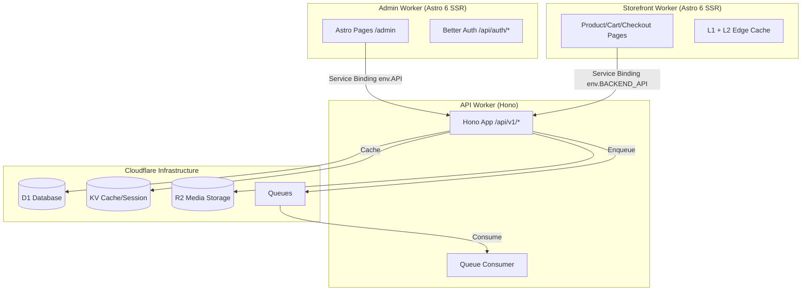

<p align="center">
  <a href="https://scalius.com">
    
  </a>
</p>

<h1 align="center">
  Scalius Commerce Lite
</h1>

<h4 align="center">
  <a href="https://docs.scalius.com">Documentation</a> |
  <a href="https://scalius.com">Website</a>
</h4>

<p align="center">
  Full-stack e-commerce platform — admin dashboard, storefront, and API — Turborepo monorepo with Astro, Hono, and Cloudflare D1.
</p>

<p align="center">
  <a href="https://github.com/scaliuslabs/scalius-commerce-lite/blob/master/LICENSE">
    
  </a>
  <a href="https://github.com/scaliuslabs/scalius-commerce-lite/blob/master/CONTRIBUTING.md">
    
  </a>
  <a href="https://github.com/scaliuslabs/scalius-commerce-lite/blob/master/SECURITY.md">
    
  </a>
</p>

<p align="center">
  <a href="https://scalius.com/x">
    
  </a>
  <a href="https://scalius.com/discord">
    
  </a>
  <a href="https://scalius.com/facebook">
    
  </a>
</p>

## Get Started

Scalius Commerce Lite is a **Turborepo monorepo** containing three Cloudflare Workers and five shared packages:

- **Admin dashboard** (`apps/admin`) — Astro 6 SSR + React 19 admin UI
- **API worker** (`apps/api`) — Standalone Hono API + queue consumer
- **Storefront** (`apps/storefront`) — Astro 6 SSR + React 19 customer-facing store

Admin and storefront communicate with the API worker via **Cloudflare Service Bindings** (zero-latency, no network hop in production).

### Monorepo structure

```text
apps/
  admin/          # @scalius/admin — Astro 6 SSR admin dashboard (Cloudflare Worker)
  api/            # @scalius/api — Hono standalone API + queue consumer (Cloudflare Worker)
  storefront/     # @scalius/storefront — Astro 6 SSR customer store (Cloudflare Worker)
packages/
  api-client/     # @scalius/api-client — Generated SDK from OpenAPI spec
  core/           # @scalius/core — Domain modules, auth, integrations, search
  database/       # @scalius/database — Drizzle schema, client, migrations
  shared/         # @scalius/shared — Pure utility functions (currency, image-optimizer, etc.)
  tsconfig/       # @scalius/tsconfig — Shared TypeScript configs
scripts/          # Dev setup, deploy, reset, dev server wrapper
```

### Key URLs (local dev)

| URL | Service |
|-----|---------|
| `http://localhost:4321/admin` | Admin dashboard |
| `http://localhost:4321/auth/login` | Auth pages |
| `http://localhost:4322` | Storefront |
| `http://localhost:8787/api/v1/` | API root |
| `http://localhost:8787/api/v1/docs` | Swagger UI (interactive API docs) |
| `http://localhost:8787/api/v1/openapi.json` | OpenAPI 3.0 spec (221 paths) |
| `http://localhost:8787/api/v1/health` | Health check |

### Tech stack

| Layer | Technology |
|-------|-----------|
| Monorepo | Turborepo + pnpm workspaces |
| Admin & Storefront | Astro 6 (SSR, Cloudflare adapter) + Vite 7 + React 19 |
| API | Hono + @hono/zod-openapi (auto-generated OpenAPI/Swagger) |
| Database | Cloudflare D1 (SQLite) + Drizzle ORM + FTS5 full-text search |
| UI | Tailwind CSS v4 + shadcn/ui |
| Auth | Better Auth (email/password + optional admin 2FA) |
| Caching | Cloudflare KV + in-memory L1 + Cache API L2 (storefront) |
| Storage | Cloudflare R2 for media uploads |
| Queues | Cloudflare Queues for async processing (payments, notifications, OTP) |
| Testing | Vitest (174 tests across shared utils, product/order validation) |
| Deploy | Cloudflare Workers via Wrangler |

### Features

- **Commerce**: products (variants, images, rich content), categories, attributes, collections
- **Sales**: orders, customers, abandoned checkouts, discounts
- **Storefront content**: header/footer builders, navigation, pages, hero sliders, widgets
- **Operations**: shipping methods, delivery providers/shipments, fraud checker, cache management
- **Media**: R2-backed uploads + Cloudflare Image Resizing via CDN
- **Notifications**: admin push notifications for new orders (Firebase Cloud Messaging)
- **AI**: OpenRouter-powered widget/content generation and prompt tooling
- **Security**: optional admin 2FA (authenticator app or email OTP), RBAC, rate limiting, CSP

---

## Architecture



### Admin Worker (`apps/admin`)

- Astro 6 SSR pages + React 19 components
- Owns auth pages (`/api/auth/*` via Better Auth)
- Middleware handles session validation, RBAC, CSP headers
- Proxies `/api/v1/*` to the API worker via service binding (prod) or Vite proxy (dev)

### Storefront Worker (`apps/storefront`)

- Astro 6 SSR + React 19 customer-facing store
- Product pages, cart, checkout, search, account, sitemaps
- Service binding `BACKEND_API` -> API worker (0ms latency in prod)
- Two-tier caching: L1 in-memory + L2 Cloudflare Cache API with KV version control
- Imports `@scalius/shared` (utilities) and `@scalius/api-client` (types). Does NOT import `@scalius/core` or `@scalius/database` directly.

### API Worker (`apps/api`)

- Standalone Hono app at `/api/v1/*` with auto-generated OpenAPI spec
- All routes use `@hono/zod-openapi` `createRoute()` for type-safe request validation + Swagger docs
- Thin HTTP layer delegates to `@scalius/core` domain services
- Standardized error handling via `ApiError` classes (`apps/api/src/utils/api-error.ts`)
- Queue consumer handles payment events, order notifications, OTP delivery, order ingestion

### Shared Packages (JIT — no build step)

All packages are consumed directly as TypeScript by the bundler (esbuild/wrangler). No compilation step needed.

| Package | Purpose |
|---------|---------|
| `@scalius/api-client` | Generated SDK from OpenAPI spec (types + client functions) |
| `@scalius/core` | Domain services (`src/modules/`), Better Auth, RBAC, integrations, FTS5 search |
| `@scalius/database` | Drizzle schema (11 domain files), `getDb()` client factory, migrations |
| `@scalius/shared` | Pure utilities (currency, image-optimizer, media-url, CORS, rate-limit) |
| `@scalius/tsconfig` | Shared TypeScript configs (base, astro, worker) |

### Dependency graph

```
@scalius/shared          -> (no deps)
@scalius/database        -> drizzle-orm, @scalius/shared
@scalius/core            -> @scalius/database, @scalius/shared, better-auth, zod
@scalius/api-client      -> (generated, no runtime deps)
@scalius/api             -> @scalius/core, @scalius/database, @scalius/shared, hono
@scalius/admin           -> @scalius/core, @scalius/database, @scalius/shared, @scalius/api-client, astro, react
@scalius/storefront      -> @scalius/shared, @scalius/api-client, astro, react
```

---

## Scripts

All commands run from the repo root:

```bash
# Development
pnpm dev              # Start admin :4321 + API :8787
pnpm dev:storefront   # Start storefront :4322 + API :8787
pnpm dev:all          # Start all three workers (staggered to avoid port conflicts)

# Build & Deploy
pnpm build            # Build all workspaces
pnpm deploy           # Build + migrate + deploy all workers

# Database
pnpm db:generate      # Generate Drizzle migrations from schema changes
pnpm db:migrate:local # Apply pending migrations locally
pnpm db:studio        # Drizzle Studio DB browser

# Testing
pnpm test             # Run all tests via vitest
pnpm test:watch       # Run tests in watch mode

# Setup & Maintenance
pnpm dev:setup        # First-time local setup (creates .dev.vars, applies migrations)
pnpm dev:reset        # Wipe local DB and re-apply migrations
pnpm generate:sdk     # Regenerate API client from OpenAPI spec
```

---

## Local Development

### 1) First-time setup

```bash
pnpm dev:setup
```

This creates `.dev.vars` in each app directory, creates `apps/admin/.env.development`, and applies D1 migrations to the local database.

### 2) Start the app

```bash
pnpm dev          # Admin + API
pnpm dev:all      # All three workers
```

The dev server uses `scripts/dev.sh` which:
- Kills stale processes from previous runs automatically
- Starts workers with staggered delays to prevent Vite inspector port conflicts
- Cleans up all child processes on Ctrl+C

### 3) Create the first admin account

Visit `http://localhost:4321/admin`. If no admin exists, middleware redirects to `/auth/setup`. The first account is created as super admin and RBAC roles/permissions are seeded automatically.

### 4) Reset commands

```bash
pnpm dev:reset        # Wipe .wrangler/state and re-apply all migrations
pnpm db:migrate:local # Apply pending migrations without wiping data
```

---

## Environment Variables

Each worker has its own configuration files. `pnpm dev:setup` generates everything automatically.

### Configuration surfaces

1. **`wrangler.jsonc`** (per worker) — Cloudflare bindings and non-secret production vars
2. **`.dev.vars`** (per worker) — Runtime secrets for local development
3. **`.env.development`** (`apps/admin/` only) — Vite/Astro build-time vars
4. **Admin dashboard settings** — Third-party providers stored in the database

See `.dev.vars.example` and `.env.example` at the repo root for reference.

### Runtime secrets (`.dev.vars`)

| Variable | Required | Purpose |
|----------|----------|---------|
| `BETTER_AUTH_SECRET` | Yes | Better Auth signing secret |
| `JWT_SECRET` | Yes | JWT signing for protected API flows |
| `API_TOKEN` | Yes | Machine-to-machine token for `/api/v1/auth/token` |
| `BETTER_AUTH_URL` | Yes | Auth callback origin (`http://localhost:4321` locally) |
| `PUBLIC_API_BASE_URL` | Yes | API base URL (`http://localhost:8787` locally) |
| `STOREFRONT_URL` | Yes | Storefront origin for redirects/payment callbacks |

### Dashboard-configured integrations

| Integration | Where to configure |
|-------------|-------------------|
| Resend email key + sender | **Settings -> Email** |
| Firebase public config + service account | **Settings -> Notifications** |
| Stripe / SSLCommerz / Polar + payment methods | **Settings -> Payments** |
| Delivery provider credentials | **Settings -> Delivery Providers** |
| OpenRouter API key | Widget generator settings dialog |

---

## API Documentation

- **Swagger UI**: `http://localhost:8787/api/v1/docs` — interactive API explorer with all 221 routes
- **OpenAPI spec**: `http://localhost:8787/api/v1/openapi.json` — auto-generated from route definitions
- **Auth**: Click "Authorize" in Swagger UI and enter a Bearer JWT token (obtain via `GET /auth/token` with `X-API-Token` header)

### Route namespacing

| Prefix | Auth | Purpose |
|--------|------|---------|
| `/api/v1/admin/**` | Session/JWT + RBAC | Admin CRUD operations |
| `/api/v1/orders/**` | JWT | Customer order management |
| `/api/v1/cache/**` | Admin JWT | Cache management |
| `/api/v1/products`, `/categories`, etc. | None | Public storefront endpoints |
| `/api/v1/webhooks/**` | Signature verification | Payment gateway callbacks |

### Consolidated endpoints (reduce client round-trips)

- `GET /api/v1/storefront/homepage` — hero sliders, widgets, collections, SEO
- `GET /api/v1/storefront/layout` — header/footer, navigation, analytics scripts

---

## Database & Migrations

- **Schema**: `packages/database/src/schema/` (11 domain files)
- **Client**: `packages/database/src/client.ts` (`getDb()` factory)
- **Migrations**: `packages/database/migrations/`
- **ORM**: Drizzle ORM 0.45.x

### Full-text search (FTS5)

All text search uses **SQLite FTS5** with external content tables. INSERT/UPDATE/DELETE triggers keep indexes in sync automatically.

- FTS5 tables: `products_fts`, `product_variants_fts`, `categories_fts`, `pages_fts`, `orders_fts`, `customers_fts`, `discounts_fts`, `abandoned_checkouts_fts`
- Query helpers: `packages/core/src/search/fts5.ts`

---

## Queues

| Queue | Purpose | DLQ |
|-------|---------|-----|
| `payment-events` | Payment gateway webhook events (Stripe, SSLCommerz, Polar) | Yes |
| `order-notifications` | Push notifications for new orders | No |
| `auth-otp` | Async email/OTP delivery | Yes |
| `order-ingest` | High-concurrency order creation with batched inventory | Yes |

Queue consumer: `apps/api/src/queue-consumer.ts`

---

## Testing

```bash
pnpm test          # Run all tests
pnpm test:watch    # Watch mode
```

Test suites:
- `packages/shared/src/__tests__/utils.test.ts` — Shared utility functions (86 tests)
- `packages/core/src/modules/products/__tests__/validation.test.ts` — Product schemas (37 tests)
- `packages/core/src/modules/orders/__tests__/validation.test.ts` — Order schemas (51 tests)
- `apps/api/src/__tests__/health.test.ts` — API smoke test (2 tests)

---

## Deployment

```bash
pnpm deploy
```

Runs `scripts/deploy.mjs` which:
1. Applies D1 migrations (remote)
2. Builds all workers
3. Deploys to Cloudflare Workers via Wrangler

### Production domains

| Domain | Worker |
|--------|--------|
| `dashboard.scalius.com` | scalius-admin |
| `api.scalius.com` | scalius-api |
| `storefront.scalius.com` | scalius-storefront |
| `cloud.scalius.com` | R2 bucket (CDN + Image Resizing) |

---

## Key File Paths

| File | Purpose |
|------|---------|
| `apps/api/src/worker.ts` | API Worker entry (WorkerEntrypoint) |
| `apps/api/src/app.ts` | Hono app with all route mounts + OpenAPI config |
| `apps/api/src/utils/api-error.ts` | Standardized error classes (ApiError, ValidationError, etc.) |
| `apps/api/src/utils/api-response.ts` | Response helpers (ok, created, paginated, noContent) |
| `apps/api/src/queue-consumer.ts` | Queue message handler |
| `apps/admin/src/middleware.ts` | Auth + RBAC + CSP middleware |
| `apps/admin/src/lib/auth-client.ts` | Better Auth React client |
| `apps/storefront/src/middleware.ts` | Caching + API context middleware |
| `apps/storefront/src/lib/api/client.ts` | Storefront API client (JWT + service binding) |
| `apps/storefront/src/lib/edge-cache.ts` | Two-tier caching layer |
| `packages/core/src/auth/auth.ts` | Better Auth server config |
| `packages/core/src/modules/customers/customer-auth.service.ts` | Customer auth service (OTP, sessions) |
| `packages/database/src/schema/` | Drizzle schema (11 files) |
| `packages/database/migrations/` | SQL migrations |
| `packages/api-client/src/generated/` | Generated SDK types + client |
| `scripts/dev.sh` | Dev server wrapper (staggered start + cleanup) |

---

## Recent Changes (March 2026)

Major refactor from monolith to Turborepo monorepo:

- Migrated all 67 API routes to `@hono/zod-openapi` with `createRoute()` for auto-generated OpenAPI
- Created `@scalius/api-client` package with generated SDK
- Extracted business logic from route handlers into `@scalius/core` services
- Deduplicated storefront utilities into `@scalius/shared`
- Added 174 tests (vitest)
- Upgraded all dependencies to latest (Drizzle 0.45, Astro 6.0.4, wrangler 4.73, etc.)

### Known backlog

- **SDK regeneration needed**: The `@scalius/api-client` types are generated from an older spec. Run `pnpm generate:sdk` after starting the API to regenerate from the live 221-path spec.
- **Response standardization**: API response helpers (`ok()`, `paginated()`) exist but aren't used by routes yet. Routes still use raw `c.json()` with inconsistent shapes.
- **Major version upgrades pending**: TipTap 2->3, Firebase 11->12, Recharts 2->3, react-day-picker 8->9
- **ESLint**: Not yet configured. `.prettierrc.mjs` exists for formatting.

---

## Troubleshooting

- **"CRITICAL SECURITY ERROR: Using default JWT secret"** — Set `JWT_SECRET` in `.dev.vars` or production secrets.
- **"BETTER_AUTH_SECRET is not set"** — Set in `.dev.vars`. Generate: `openssl rand -base64 32`
- **Auth sign-in loops** — Ensure admin runs on `http://localhost:4321`. Run `pnpm dev:setup --force` to regenerate env files.
- **Port conflicts on startup** — The dev script (`scripts/dev.sh`) auto-kills stale processes. If issues persist, manually run: `lsof -ti :8787,:4321,:4322 | xargs kill -9`
- **D1 errors in dev** — Run `pnpm db:migrate:local` or `pnpm dev:reset` for a clean database.
- **Swagger UI shows "No parameters"** — Ensure `@hono/zod-openapi` is v1.2.2+ (Zod v4 compatible). Check `apps/api/package.json`.
