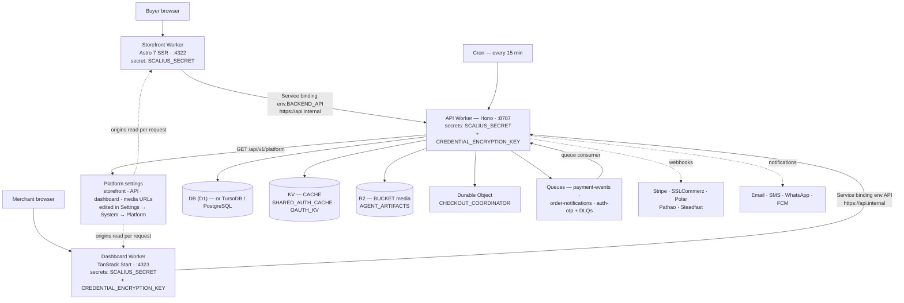

<p align="center">
  <a href="https://scalius.com">
    
  </a>
</p>

<h1 align="center">
  Scalius Commerce Lite
</h1>

<h4 align="center">
  <a href="https://docs.scalius.com">Documentation</a> |
  <a href="https://scalius.com">Website</a>
</h4>

<p align="center">
  Self-hosted e-commerce platform — admin dashboard, storefront, and API — deployed as three Cloudflare Workers. Turborepo monorepo with TanStack Start, Astro, Hono, and portable D1, TursoDB, or PostgreSQL storage.
</p>

<p align="center">
  <a href="LICENSE">
    
  </a>
  <a href="https://github.com/scaliuslabs/scalius-commerce-lite/issues">
    
  </a>
  <a href="SECURITY.md">
    
  </a>
</p>

<p align="center">
  <a href="https://scalius.com/x">
    
  </a>
  <a href="https://scalius.com/discord">
    
  </a>
  <a href="https://scalius.com/facebook">
    
  </a>
</p>

---

## Repository layout

```text
apps/
  admin-v2/     @scalius/admin-v2    TanStack Start dashboard  (Worker, dev :4323)
  api/          @scalius/api         Hono API + queue consumer (Worker, dev :8787)
  storefront/   @scalius/storefront  Astro SSR store           (Worker, dev :4322)
packages/
  api-client/   Generated SDK from the API's OpenAPI spec
  cli/          `scalius` CLI — operates a deployed store over its OpenAPI contract
  core/         Domain services, auth/RBAC, provider integrations
  database/     Drizzle schema, migrations, provider adapters
  shared/       Pure utilities (runtime secrets, platform config, formatting)
  tsconfig/     Shared TypeScript configs
docs/           Architecture, database portability, performance, delivery providers
scripts/        Dev setup, dev server wrapper, deploy pipeline, checks
```

| Layer | Technology |
|-------|------------|
| Monorepo | Turborepo + pnpm workspaces |
| Dashboard | TanStack Start / Router / Query, React 19, Vite 8 |
| Storefront | Astro 7 SSR + React 19 islands |
| API | Hono + `@hono/zod-openapi` (generated OpenAPI + Swagger UI) |
| Database | Drizzle ORM on Cloudflare D1 (default), TursoDB, or PostgreSQL/Neon |
| UI | Tailwind CSS v4 + shadcn/ui + Radix |
| Auth | Better Auth (email/password, optional TOTP + email OTP 2FA) |
| Storage | R2 for media, Cloudflare Image Resizing |
| Async | Cloudflare Queues (payments, notifications, OTP + DLQs), 15-minute cron |
| Payments | Stripe, SSLCommerz, Polar, Cash on Delivery |
| Delivery | Pathao, Steadfast (webhook tracking) |
| Notifications | Email (Cloudflare Email, Resend fallback), SMS (4 providers), WhatsApp, FCM push |
| Deploy | Wrangler |

## Architecture



Two secrets are installed per Worker; every other per-purpose secret is HKDF
derived from `SCALIUS_SECRET` at Worker entry. The dashboard and storefront hold
no database, provider, or URL configuration of their own: they call the API
through a Cloudflare Service Binding in production (over HTTP to
`http://localhost:8787` in local development) and read the deployment's public
origins from `GET /api/v1/platform`.

See [docs/ARCHITECTURE.md](docs/ARCHITECTURE.md) for module boundaries, the
order lifecycle, and invariants.

## Features

**Catalog** — products with merchant-defined variant axes, SKUs, barcodes, images, attributes; categories; manual and dynamic collections; inventory with compare-and-swap stock versioning, reservations, and low-stock alerts; provider-aware search (FTS5 with a Bengali tokenizer on D1, bounded indexed fallback elsewhere).

**Sales** — 11-status order state machine with validated transitions; Stripe, SSLCommerz, Polar, and Cash on Delivery; atomic payment commits with four idempotency layers; refunds and returns; discounts and promotions; abandoned checkout tracking; customer accounts with OTP sign-in and order history.

**Content** — header/footer and navigation builders, CMS pages and blog articles with a Tiptap editor, hero sliders, theme tokens.

**Operations** — Pathao and Steadfast shipments plus manual fulfillment; flat-rate, weight-based, and zone-based shipping; taxes; invoice PDFs; a manual per-order fraud checker; cache management; a QR scanner app.

**Notifications** — 15 order and refund notification types over four independently configured channels (email, SMS, WhatsApp, FCM push), delivered through a queue with a durable outbox and per-channel receipts.

**Security** — Better Auth with optional 2FA, RBAC (81 permissions in 13 categories), per-endpoint rate limiting, AES-256-GCM encryption of merchant provider credentials, per-provider webhook signature verification.

**Discovery** — canonical URLs, robots, sitemap index and children, JSON-LD, Google and Meta product feeds, `/llms.txt`, and read-only UCP catalog discovery at `/.well-known/ucp`.

## Local development

### Prerequisites

| Requirement | Notes |
|-------------|-------|
| Node.js 24 | Version pinned in `.nvmrc`; run `nvm use` |
| pnpm 11.20 | Pinned in `package.json` `packageManager`; `corepack enable` |
| Cloudflare account | Only needed to deploy, not for local development |
| Mailpit (optional) | Local inbox for dev email/OTP — `brew install mailpit` |

### Setup

```bash
nvm use
pnpm install
pnpm dev:setup
pnpm dev
```

`pnpm dev:setup` generates the two secrets into each app's `.dev.vars`
(gitignored), applies local D1 migrations, and creates a default local admin
through `/api/v1/setup`. It writes no URLs — local development falls back to
fixed localhost ports in code.

Default local admin: `admin@local.scalius.test` / `ScaliusLocal123!`. Override
with `--admin-email`, `--admin-password`, `--admin-name`, or the matching
`LOCAL_ADMIN_*` environment variables.

`pnpm dev` starts or reuses a loopback Mailpit inbox, applies pending local D1
migrations, refuses to start when an app port is already taken, waits for
`/api/v1/setup` before starting the dashboard and storefront, and cleans up only
the processes it started. Set `SCALIUS_SKIP_DEV_MIGRATIONS=1` to skip the
migration check.

| URL | Service |
|-----|---------|
| `http://localhost:4323/admin` | Admin dashboard |
| `http://localhost:4322` | Storefront |
| `http://localhost:8787/api/v1/docs` | Swagger UI |
| `http://localhost:8787/api/v1/openapi.json` | OpenAPI spec |
| `http://localhost:8787/api/v1/health` | Health check |
| `http://127.0.0.1:8025` | Mailpit inbox |

Run `pnpm dev:doctor` at any time for a non-mutating report on Node version,
local secrets, database state, and ports. After starting servers, use the
profile that matches what you started: `dev:doctor:api`, `dev:doctor:admin`,
`dev:doctor:storefront`, or `dev:doctor:all`.

To run against a disposable state directory:

```bash
pnpm dev:reset --state /tmp/scalius-state
SCALIUS_WRANGLER_STATE=/tmp/scalius-state pnpm dev:admin
```

## Commands

```bash
# Development
pnpm dev                  # API :8787 + dashboard :4323 + storefront :4322
pnpm dev:api              # API only
pnpm dev:admin            # API + dashboard
pnpm dev:storefront       # API + storefront
pnpm dev:doctor[:api|:admin|:storefront|:all]

# Local state
pnpm dev:setup            # Install, write .dev.vars, migrate D1, create admin
pnpm dev:setup --env-only # Repair missing .dev.vars keys only
pnpm dev:reset            # Wipe local D1/KV/R2/cache state and recreate the admin
pnpm dev:admin:create | dev:admin:reset | dev:admin:status

# Database
pnpm db:generate          # Generate Drizzle migrations from schema changes
pnpm db:migrate:local     # Apply pending migrations locally
pnpm db:migrate:remote    # Apply pending migrations to remote D1
pnpm db:studio            # Drizzle Studio

# Quality
pnpm lint                 # ESLint across the eight code workspaces
pnpm typecheck            # tsc (not esbuild)
pnpm test                 # Vitest
pnpm check:env            # Fail on any Wrangler `vars` entry
pnpm generate:sdk         # Regenerate @scalius/api-client from the OpenAPI spec

# Build & deploy
pnpm build
pnpm run deploy                        # All three Workers
pnpm run deploy:api | :admin | :storefront
pnpm ops:check                         # Read-only production API smoke
pnpm release:check                     # Read-only release smoke across all surfaces
```

Root Turbo commands run through `scripts/turbo-run.mjs`, which resolves the
active Corepack/pnpm executable first so they work in shells where `pnpm` is not
on `PATH`.

## Configuration

Runtime configuration is deliberately small: **two installed secrets, zero
Wrangler `vars`, everything else in the dashboard.**

### Installed secrets

| Secret | Workers | Purpose | Generate with |
|--------|---------|---------|---------------|
| `SCALIUS_SECRET` | API, dashboard, storefront | Master secret; identical on all three, at least 32 characters | `openssl rand -base64 48` |
| `CREDENTIAL_ENCRYPTION_KEY` | API, dashboard | AES-256-GCM key for merchant provider credentials at rest; base64 of exactly 32 bytes, identical on both | `openssl rand -base64 32` |

Every per-purpose secret — Better Auth session signing, JWT signing, the
internal service token, the storefront purge token, the agent token pepper, and
the customer session hash key — is HKDF-SHA256 derived from `SCALIUS_SECRET` at
Worker entry (`packages/shared/src/runtime-secrets.ts`). Derived values are
never installed, stored, or logged.

Without `SCALIUS_SECRET` the API fails closed: every request except
`/api/v1/health` and `/api/v1/readyz` returns `503 RUNTIME_SECRET_MISSING`.

**Rotation.** Rotating `SCALIUS_SECRET` rotates every derived secret at once:
admins are signed out, service tokens and purge tokens stop verifying, and agent
credentials must be reissued. Encrypted provider credentials survive, because
they use `CREDENTIAL_ENCRYPTION_KEY`. Rotating `CREDENTIAL_ENCRYPTION_KEY` makes
stored provider credentials undecryptable — every payment, delivery, SMS, and
email credential must be re-entered in the dashboard. Install it on the API and
dashboard in one pass; a mismatch breaks credential reads.

### Platform settings (Settings → System → Platform)

Public origins are database-backed merchant settings, not environment variables.

| Setting | Required | Purpose |
|---------|----------|---------|
| Storefront URL | yes | Canonical storefront origin (canonical links, sitemaps, purge target) |
| API URL | yes | Public API origin browsers call |
| Dashboard URL | yes | Dashboard origin (Better Auth base URL) |
| Media URL | yes | Public media base URL (R2 custom domain) |
| Customer cookie domain | no | `Domain` attribute for customer session cookies across subdomains |
| Extra CORS origins | no | Additional origins allowed to make credentialed API requests |

The API serves the four origins publicly at `GET /api/v1/platform`
(`Cache-Control: public, max-age=60`); the storefront and dashboard Workers read
that endpoint per request. `GET /api/v1/readyz` reports a required
`platform_config` check listing any missing origin.

Names such as `env.STOREFRONT_URL`, `env.PUBLIC_API_BASE_URL`,
`env.BETTER_AUTH_URL`, `env.R2_PUBLIC_URL`, `env.CDN_DOMAIN_URL`,
`env.PURGE_URL`, and `env.CORS_ALLOWED_ORIGINS` still appear in code. They are
composed from these settings at Worker entry
(`apps/api/src/runtime/runtime-env.ts`) and are never configured in Wrangler or
`.dev.vars`.

### Everything else in the dashboard

| Integration | Location |
|-------------|----------|
| Email (Cloudflare Email / Resend) | Settings → Email |
| Stripe / SSLCommerz / Polar | Settings → Checkout → Payment gateways |
| Pathao / Steadfast | Settings → Delivery providers |
| SMS, WhatsApp, Firebase (FCM) | Settings → Notifications |
| Analytics and tracking scripts | Analytics |

### Database provider

D1 is the zero-configuration default and is already bound in the Wrangler
configs. TursoDB deployments install `TURSO_DATABASE_URL` and `TURSO_AUTH_TOKEN`
as secrets on the API and dashboard; PostgreSQL deployments install
`POSTGRES_DATABASE_URL` or bind `HYPERDRIVE`. Complete credentials select the
provider on their own; `DATABASE_PROVIDER` (`d1` | `turso` | `postgres`) is an
optional explicit pin, required only when both Turso and PostgreSQL credentials
are installed. `DATABASE_MIGRATION_FREEZE` is an operations-only cutover switch.
None of these appear in the checked-in configs — installing one is a deliberate
operator action.

Switching providers is not a credential swap. See
[docs/DATABASE-PORTABILITY.md](docs/DATABASE-PORTABILITY.md) for the freeze,
snapshot, import, and fingerprint protocol.

## Deployment

### 1. Create the Cloudflare resources

The three `wrangler.jsonc` files are the source of truth. Create each resource
in your own account and replace the checked-in names and IDs:

| Resource | Where | Binding |
|----------|-------|---------|
| D1 database | API, dashboard | `DB` |
| KV namespaces | API: `CACHE`, `SHARED_AUTH_CACHE`, `OAUTH_KV`<br/>Dashboard: `CACHE`, `SESSION`, `SHARED_AUTH_CACHE`<br/>Storefront: `SESSION` | (the dashboard and storefront `SESSION` namespaces are separate) |
| R2 buckets | API: media + agent artifacts<br/>Dashboard: media | `BUCKET`, `AGENT_ARTIFACTS` |
| Queues | `payment-events`, `order-notifications`, `auth-otp` and one DLQ each | producers + consumers on the API |
| Rate limiters | API: search, order IP, order phone, agent | 4 namespace IDs |
| Email routing | API, dashboard | `send_email` binding `EMAIL` |
| Service bindings | Dashboard → API, storefront → API | `API`, `BACKEND_API` |

The `CHECKOUT_COORDINATOR` Durable Object is created by the deploy migration.
All three Workers set `workers_dev: false`, so each needs a custom domain. The
storefront's is declared in `apps/storefront/wrangler.jsonc` (`routes`); point a
custom domain at the API and dashboard Workers in the Cloudflare dashboard, and
attach a public custom domain to the media R2 bucket.

`pnpm check:env` fails on any Wrangler `vars` entry — keep the configs to
bindings only.

### 2. Install the secrets

Wrangler prompts for each value; it is never written to a file or committed.

```bash
pnpm --dir apps/api        exec wrangler secret put SCALIUS_SECRET
pnpm --dir apps/api        exec wrangler secret put CREDENTIAL_ENCRYPTION_KEY
pnpm --dir apps/admin-v2   exec wrangler secret put SCALIUS_SECRET
pnpm --dir apps/admin-v2   exec wrangler secret put CREDENTIAL_ENCRYPTION_KEY
pnpm --dir apps/storefront exec wrangler secret put SCALIUS_SECRET
```

### 3. Deploy

```bash
pnpm run deploy -- --api-url https://api.example.com --storefront-url https://shop.example.com
```

The pipeline runs `typecheck → build → D1 migrations → deploy each Worker →
post-deploy verification`. Targeted deploys (`deploy:api`, `deploy:admin`,
`deploy:storefront`) use the same wrapper.

Because the Wrangler configs carry no `vars`, the script has no built-in
knowledge of your public origins:

| Origin | Resolution order |
|--------|------------------|
| API | `--api-url` or `SCALIUS_API_URL` only |
| Storefront | `--storefront-url` or `SCALIUS_STOREFRONT_URL`, else the `custom_domain` route pattern in `apps/storefront/wrangler.jsonc`, else the Platform `storefrontUrl` read from the API |

If the API origin is unknown the deploy still succeeds; live `/health` and
`/readyz` verification and API-driven storefront cache warming are skipped with
a notice. If the deploy target and the Platform `storefrontUrl` disagree, the
script warns, because canonical and sitemap URLs come from the setting.

### 4. Complete Platform settings

Sign in to the dashboard (first run offers the first-admin setup flow at
`/auth/setup`), then fill **Settings → System → Platform** with the storefront,
API, dashboard, and media URLs.

This step is not optional. Until it is done, `/api/v1/readyz` reports
`platform_config: missing` and the storefront's credentialed browser features —
cart, customer sign-in — fail, because CORS allowlists and cookie domains are
derived from those origins.

### 5. Verify

```bash
curl https://api.example.com/api/v1/readyz
pnpm ops:check
pnpm release:check
```

## Troubleshooting

| Problem | Fix |
|---------|-----|
| Port already in use on `pnpm dev` | The wrapper prints the occupied port, PID, and command; stop that process and rerun |
| Forgot the local admin password | `pnpm dev:admin:reset` |
| Local sign-in loops | `pnpm dev:admin:reset`, then `pnpm dev:setup --env-only` for missing keys, or `--force --env-only` when the shared local secrets are out of sync |
| Local D1 errors | `pnpm dev:reset` |
| `503 RUNTIME_SECRET_MISSING` | `SCALIUS_SECRET` is missing or shorter than 32 characters — `wrangler secret put SCALIUS_SECRET`, or `pnpm dev:setup --env-only` locally |
| `/api/v1/readyz` reports `platform_config: missing` | Fill the listed origins in Settings → System → Platform |
| Storefront cart or sign-in fails with CORS/cookie errors | The Platform origins are wrong or unset |
| Provider credentials fail to decrypt | `CREDENTIAL_ENCRYPTION_KEY` differs between the API and dashboard, or was rotated — re-enter the credentials in the dashboard |
| `pnpm check:env` fails on Wrangler vars | Delete the `vars` block; URLs belong in Platform settings, secrets in `wrangler secret put` |
| Stale SDK types | `pnpm generate:sdk` with the API running |

## Contributing, security, license

- [CONTRIBUTING.md](CONTRIBUTING.md) — issue forms and contribution policy
- [SECURITY.md](SECURITY.md) — vulnerability reporting
- [CODE_OF_CONDUCT.md](CODE_OF_CONDUCT.md)

Except for the separately MIT-licensed storefront in `apps/storefront/`, this
repository is licensed under [AGPL v3](LICENSE).
