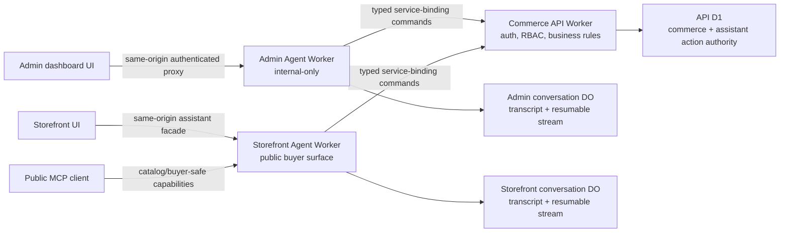

# Agent Platform Target Architecture

Status: Accepted target ADR

Accepted: 2026-07-10

Implementation status: In progress — the two read-only Worker boundaries are deployed; shared protocol, API-D1 authority schema/core, isolated conversation DO runtimes, exhaustive Admin operation policy inventory, strict Storefront context/cart foundations, and provider-neutral model runtime are local and verified. Consumer cutover, same-origin conversation facade integration, command adapters, complete capabilities, and final UI/live proof remain.

Release checklist: [`audit/AGENT-PLATFORM-REQUIREMENTS.md`](../../audit/AGENT-PLATFORM-REQUIREMENTS.md)

## Purpose And Scope

This ADR defines the target architecture for the Scalius Admin Copilot and Storefront Shopping Assistant. The product requires two separately deployed MCP servers/agent runtimes, durable and resumable workflows, complete commerce capability coverage, a shared high-quality interaction model, and hard server-side authorization and confirmation boundaries.

This is a target-state decision, not a claim that the complete product is already available. The former combined Worker has been split and the two least-privilege read-only replacements are deployed. Their distinct SQLite-backed conversation Durable Object classes, bounded redacted stores, resumable WebSocket/poll transports, cancellation, duplicate suppression, and retention deletion are implemented locally; coordinated consumer cutover and same-origin facade wiring remain. [`MCP-AGENT-ARCHITECTURE.md`](./MCP-AGENT-ARCHITECTURE.md) and MCP-001 through MCP-026 in [`audit/REMEDIATION_TRACKER.md`](../../audit/REMEDIATION_TRACKER.md) remain the historical sources for shipped verification. This ADR supersedes their one-Worker target and future-runtime direction without erasing their safety constraints or evidence.

The stable release may not relabel a missing objective as an optional follow-up. Realtime voice is the only optional product capability. If voice is enabled, all voice requirements in this ADR become release-blocking for that enabled surface.

## Decision Summary

1. Deploy an internal-only Admin Agent Worker and a public Storefront Agent Worker as independent Cloudflare Workers with independent bindings, state stores, limits, deploys, and rollback paths.
2. Keep `apps/api` as the sole authority for commerce facts, authentication, RBAC, checkout, payment, order, inventory, settings, and provider credentials. Agent Workers orchestrate typed API commands; they do not become alternate commerce backends.
3. Give each Agent Worker an isolated Durable Object namespace for its conversation transcript, resumable model stream, and transient subscriber coordination. Keep assistant sessions, workflows, prepared actions, approvals, idempotency claims, authoritative event cursors, and redacted execution audit records in API-owned D1 so permission checks and commerce commits share one policy/transaction boundary. Durable Objects may never become the authority for commerce or completed command state.
4. Implement all model-initiated state changes through a server-owned, versioned command registry with schema validation, execution-time authorization, preview, confirmation, idempotency, optimistic concurrency, audit, and deterministic results.
5. Treat the browser as a presentation and visible-page adapter, not an authority. It may focus, draft, navigate, refresh, and render registered actions; commerce commits always return to the API command layer.
6. Reuse the existing encrypted `settings.ai` model profiles and expose a provider-neutral orchestration interface. A model proposes plans and tool calls but never grants permission, approves an action, or supplies authoritative commerce facts.
7. Ship a deterministic manual cart and checkout path alongside the assistant. Assistant failure, disablement, provider outage, or an abandoned conversation must never block ordinary commerce.

## Deployment Topology And Trust Boundaries

### Admin Agent Worker

Workspace: `apps/admin-agent`; Worker name: `scalius-admin-agent`. The former combined `apps/agent` workspace is removed.

- Has a distinct Worker name, deploy command, service binding, observability stream, rate/size limits, and rollback history.
- Has no public custom-domain route. The external dashboard route remains same-origin and proxies only to the internal service-binding host, for example `http://admin-agent.internal/mcp` and internal task/event endpoints.
- Accepts only a valid dashboard session propagated through the trusted proxy. It strips bearer fallback and rechecks onboarding, 2FA, and effective API permissions before protected work.
- Has an API service binding and its own conversation Durable Object namespace. It has no D1, queue, payment, storage-provider, notification-provider, or raw credential binding.
- May expose the complete admin copilot capability set only through the command and confirmation architecture in this ADR.

### Storefront Agent Worker

Workspace: `apps/storefront-agent`; Worker name: `scalius-storefront-agent`. The former combined `apps/agent` workspace is removed.

- Has a distinct Worker name, deploy command, service binding, observability stream, rate/size limits, and rollback history.
- Owns the public Storefront MCP transport and the buyer-assistant task/event runtime. Browser calls should remain same-origin through a storefront facade so cookies, CSP, failure handling, and origin checks stay deterministic.
- Has an API service binding and its own conversation Durable Object namespace. It has no D1 binding and no direct payment, order, customer, provider-secret, or admin binding.
- Anonymous sessions are signed, bounded, revocable, and scoped to one storefront and cart reference. Authenticated customer capabilities use the API's customer session and explicit scopes; they are never inferred from conversation text.
- Public MCP capability advertisement fails closed. UCP cart, checkout, and order capabilities stay unadvertised until their corresponding checklist rows are verified in code and live.
- Its resolvable platform identity is `https://agent.scalius.com/.well-known/ucp`. That cacheable profile advertises only UCP `2026-04-08` catalog search/lookup and no transactional capability or payment handler.

### Commerce API Worker

`apps/api` remains the policy enforcement and domain command boundary.

- Owns Better Auth and customer-session validation, onboarding and 2FA gates, RBAC, domain validation, D1 transactions, idempotency records, optimistic versions, queues, provider side effects, and domain audit records.
- Exposes a fixed, typed agent command surface over service bindings. It does not expose an arbitrary URL fetcher, SQL executor, generic internal API proxy, model-authored code runner, or unrestricted OpenAPI executor.
- Re-reads authoritative state immediately before preview and execution. Agent state, page snapshots, cached MCP results, and model text are hints only.
- Commits local idempotent state before non-repeatable provider side effects and returns a stable command result for retries.
- Owns public assistant abuse controls in D1. Storefront forwards one validated `CF-Connecting-IP` value only over the exact API service-binding route; the API maps invalid/missing values to a conservative anonymous bucket and persists only a keyed HMAC bucket hash. `ASSISTANT_RATE_LIMIT_HMAC_KEY` is a dedicated API secret with no JWT or credential-encryption fallback.

### Browser Applications

`apps/admin-v2` and `apps/storefront` own visible UI state and interaction.

- Page adapters expose allowlisted, typed snapshots with a monotonically increasing `contextVersion` and stable target IDs.
- Adapters may propose or execute visible-only actions such as focus, field draft, selection, navigation, refresh, opening a registered dialog, and submitting a registered confirmation.
- Adapters never scrape arbitrary DOM, expose hidden field values, store provider credentials, treat route visibility as permission, or directly execute an assistant-selected commerce endpoint.
- Every action is revalidated against the current route, surface registration, target ID, context version, and server result. Stale actions fail closed and offer a refresh/re-preview path.

## Authority And Data Ownership

| Data or decision | Authority | Agent copy allowed |
| --- | --- | --- |
| Admin/customer identity, session, onboarding, 2FA | API and commerce D1 | Opaque session/actor reference and expiry only |
| Effective RBAC and row/resource scope | API at execution time | Display hint only; never continuing authorization |
| Products, variants, media metadata, categories, collections | API and commerce D1/R2 policy | Bounded tool result and version for the active task |
| Orders, refunds, fulfillment, customer records | API and commerce D1 | Minimum redacted projection required for the task |
| Inventory, reservations, transfers, stock movements | API and commerce D1 | Preview/result summary with authoritative version |
| Cart, promotion, checkout, payment, recovery | API and commerce D1 | Opaque cart/checkout reference and buyer-safe summary |
| Provider credentials and encryption state | API settings domain | Readiness boolean or profile ID only |
| Conversation transcript and resumable model stream | Surface-specific Agent Durable Object | Allowed only after redaction; command outcomes reconcile from API D1 |
| Assistant session, task, step, approval, execution claim, event cursor | API and API-owned D1 | Opaque bounded projections only |
| Live subscriber list and transient stream buffers | Surface-specific Agent Durable Object | Rebuildable from the DO transcript plus API event log |
| Current visible route, draft and selection | Browser | Bounded versioned snapshot; never domain authority |

Agent conversation stores are isolated by surface. The Admin and Storefront Workers do not share a conversation namespace, cookie namespace, approval-token audience, or Durable Object namespace. The shared API D1 tables always include the surface and actor/session scope, and API authorization rejects cross-surface references. A future cross-surface handoff must pass an explicit opaque reference through the API and requires its own threat model.

## Durable Session And Workflow Model

Conversation and work are separate concepts.

- A **conversation** is the ordered human/model interaction stream.
- A **task** is a durable unit of work with a declared intent, actor/session reference, risk class, current status, and one or more steps.
- A **step** is a typed read, preview, approval wait, command execution, compensation, or UI proposal.
- An **event** is an append-only, monotonic record used to render and resume task progress.

Required task states are `queued`, `running`, `input_required`, `approval_required`, `retrying`, `succeeded`, `failed`, `compensating`, and `cancelled`. Terminal state and every external side-effect result are committed to D1 before the stream reports completion.

Each task records:

- surface, tenant/store, opaque actor/session reference, conversation ID, task ID, and trace ID;
- command and schema version, risk class, normalized argument hash, resource versions, and idempotency key;
- current step and retry count, created/updated/expiry timestamps, cancellation state, and last monotonic event sequence;
- approval reference and preview digest when required;
- redacted result summary and API domain-audit reference for state-changing commands.

The event transport may use SSE or WebSocket, but the protocol must support a resume cursor, duplicate suppression, replay from the last committed sequence, heartbeat, cancellation, and clean fallback to polling. A Durable Object may reduce fan-out latency and coordinate model cancellation. Eviction, deploy, disconnect, refresh, and navigation must not lose accepted work because D1 remains the recovery source.

Long-running bulk work executes as an API-owned job or queue workflow. The agent task follows that job by opaque ID and reports progress; it does not keep an HTTP request open or replay individual mutations after reconnect.

## Typed Command And Tool Architecture

All executable capabilities derive from one versioned server-owned registry. A descriptor includes:

- stable command ID and version;
- surface (`admin`, `storefront`, or explicitly shared read-only projection);
- input, preview, result, and error schemas;
- required API permission and any row/resource-scope resolver;
- risk class, confirmation policy, idempotency policy, timeout, retry policy, and compensation behavior;
- authoritative resource/version reads and affected cache/job/provider side effects;
- argument/result redaction rules and audit category;
- minimum UI renderer and accessibility requirements.

The shared package may contain schemas and message-part types, but only `apps/api` contains commerce handlers and authorization logic. Generated API contracts remain generated; they are not hand-edited.

The Admin Agent may use bounded capability search and describe tools plus generic `preview`/`execute` envelopes only when the command ID resolves to this fixed registry. Important or risky workflows should additionally have typed high-value MCP tools. The Storefront Agent exposes only buyer-safe typed tools; it does not expose an admin-style capability browser.

Models may chain reads and prepare a plan. They may not:

- invent a command, endpoint, URL, permission, resource ID, price, stock value, promotion, or checkout state;
- bypass preview or confirmation by decomposing a command;
- run arbitrary TypeScript, shell, SQL, browser automation, unrestricted OpenAPI, or outbound fetches;
- treat MCP tool annotations as enforcement; annotations are descriptive hints only;
- retry an ambiguous mutation without first resolving its idempotency record.

Merchant-authored copy, CMS HTML, catalog data, customer text, tool results, retrieved documents, and provider output are all untrusted data. They are structurally separated from system policy, cannot introduce commands or permissions, and pass through schema, URL, and rendering sanitizers before reaching another tool or the browser.

## Risk, Preview, Confirmation, And Idempotency

| Risk | Examples | Required interaction |
| --- | --- | --- |
| R0: read-only | Search, explain, compare, readiness, status | May run automatically within data-scope and rate limits |
| R1: local or reversible UI | Navigate, focus, draft unsaved fields, select visible rows | Clearly labeled proposal; undo or discard remains available |
| R2: persistent reversible | Create/update catalog records, update cart, apply promotion, publish scheduled content | Fresh authoritative preview and explicit user confirmation |
| R3: destructive, financial, external, sensitive, or bulk | Delete, refund, exchange, fulfillment transition, stock adjustment, bulk publish, customer communication, credential/security setting | Detailed preview, explicit confirmation control, fresh auth/2FA where policy requires it, and dual approval where merchant policy requires it |
| R4: prohibited | Permission bypass, raw secret handling by model, arbitrary code/URL/SQL, hidden payment submission, permanent audit-history deletion | Never exposed |

A confirmation is a one-use signed server artifact, not a conversational phrase. It binds the command/version, canonical argument hash, actor and session, tenant, environment, current permission-policy version, authoritative resource versions, preview digest, idempotency key, expiry, and required assurance level. Execution revalidates all fields and consumes the artifact atomically. Any material change produces a new preview.

The confirmation UI must show the exact affected resource names/IDs, field-level diff, row count and selection rule, inventory deltas, cart lines and quantities, price/promotion/tax/shipping totals, outbound notifications/provider effects, irreversible consequences, and recoverability as applicable. It must distinguish an unsaved draft, a preview, an accepted command, a running job, and a committed result.

Text such as “yes,” model self-confirmation, silence, a previous approval, or a spoken acknowledgement is insufficient for R3. Voice may prepare the preview, but R3 requires the visible confirmation control. Merchant policy may also require visible confirmation for selected R2 commands.

Every R2/R3 command has a caller-supplied idempotency key scoped to tenant, actor/session, command, and normalized intent. Retrying returns the prior deterministic result. An unknown outcome enters reconciliation, not blind replay.

## Authentication And RBAC

Authorization is enforced twice: when creating a preview and immediately before execution. The execution check is decisive.

- Admin commands use the current signed dashboard session, completed onboarding state, current 2FA truth, exact effective permission, tenant/store scope, and resource-level policy from the API.
- No command authorizes from a role-name string, a model prompt, a hidden UI control, a cached permissions array, or a previous turn.
- Permission changes revoke pending approvals that no longer pass. Long-running jobs recheck permission before each separately privileged phase and stop safely on revocation.
- A 401/403 response is redacted, non-retryable without renewed authority, and rendered as a clear sign-in/access message. The agent must not search for an alternate command to evade it.
- Admin-user management, RBAC changes, credential writes, and security settings require dedicated commands and stronger assurance. Raw secret values travel from a dedicated user-controlled form directly to the API and never enter prompts, assistant tables, Durable Objects, tool logs, or transcripts.
- Storefront private capabilities require an authenticated customer scope or a purpose-built buyer verification flow. Receipt proofs, recovery tokens, OTPs, payment credentials, and raw session material never enter MCP arguments or model context.

## Admin Copilot Capability Boundary

The Admin Agent target covers the complete merchant control surface through typed capabilities:

- create, edit, duplicate, publish/unpublish, archive/trash, restore, and policy-safe delete for products and variants;
- merchant-defined option axes, prices, discounts, barcodes/GTINs, condition, SEO/discovery fields, media, stock tracking, and product-feed effects;
- media search, selection, upload orchestration, metadata, folders, replacement, and optional image generation as a previewed asset proposal with provenance;
- categories, collections, CMS pages, menus, branding, storefront/theme/widget configuration, navigation, and discovery settings;
- orders, fulfillment, cancellation, returns, exchanges, refunds, customer communication, and payment-state workflows within existing provider/business rules;
- customers and customer groups with minimum necessary data projection and dedicated sensitive-field views;
- discounts, promotions, campaigns, eligibility, scheduling, usage limits, and impact preview;
- inventory lookup, adjustment, movement history, alerts, transfers/procurement when supported, and variant-level availability;
- shipping, tax, checkout, payment readiness, notification, analytics, SEO/feed, business, domain, AI/model, and all other store settings, with dedicated secret-safe flows;
- bulk selection, preview, job execution, progress, cancellation where safe, partial-failure reporting, export, and retry of only failed idempotent items;
- aggregate analytics, charts, comparisons, recommendations, and exports backed by API-owned facts.

“Complete” does not mean the model receives one omnipotent tool. Each capability stays resource-specific, permission-specific, and risk-classified. Domain rules in the root `AGENTS.md` remain mandatory, including variant authority, SKU audit-history protection, discovery truth, feed/sitemap invalidation, return-policy truth, checkout fail-closed behavior, and secret/PII redaction.

Capability parity is maintained as an inventory: every authorized dashboard affordance maps to a typed API command, a registered browser-only adapter, or an explicitly classified secure manual step. Drift tests fail when a new user-visible operation or setting is added without that classification. This is how the copilot avoids dashboard bottlenecks without acquiring arbitrary browser or API execution.

The Admin UI supplies route, registered form, selection, dialog, validation, and dirty-state context. The assistant can explain what is visible, propose focused drafts, navigate to exact registered destinations, and refresh after a confirmed command. It may not silently replace dirty work, submit a hidden form, or infer permission from page presence.

## Storefront Shopping Assistant Capability Boundary

The Storefront Agent target is a buyer assistant, not an autonomous merchant or payment agent.

- Understand the current public page, current product and selected variant/options, visible search/filter state, cart summary, currency, locale, and buyer-visible merchant policy.
- Search and browse current catalog data, answer follow-ups, explain product/variant differences, compare products side by side, and recommend with disclosed, factual reasons.
- Resolve merchant-defined option axes and availability before proposing cart changes.
- Add one or several products, update quantity/variant, remove lines, validate/reprice, apply or remove a promotion, and explain rejected or stale items through API-owned atomic cart commands.
- Navigate directly to safe same-origin product, category, collection, search, cart, and checkout routes with visible user confirmation where navigation changes context.
- Help through checkout by explaining steps, validating buyer-visible state, selecting approved saved references, and drafting allowlisted non-payment fields without sending raw PII to the model. The user submits payment and any sensitive identity/credential fields through deterministic checkout UI.
- Preserve the ordinary manual product, cart, and checkout path at all times; the buyer can dismiss the assistant and continue without losing state.
- Optionally support visual search or user-provided image comparison only after upload consent, retention, moderation, and accessibility requirements are implemented.
- Support authenticated post-purchase help only through separately scoped tools and explicit identity verification; order/recovery/payment secrets remain outside model context.

Catalog and availability answers use the same buyer-resolvable SKU, feed, and checkout truth as public commerce surfaces. Recommendations never fabricate product facts, promotions, delivery estimates, availability, brand, taxonomy, or return terms. When a required fact is unavailable, the assistant says so and offers the deterministic page.

UCP remains capability-negotiated. The public profile continues to advertise catalog search/lookup only until cart/session/idempotency proof is complete. Cart is added only after atomic mutation and reconciliation tests pass; checkout/order are added only after the D1 session, confirmation, signing, payment, recovery, privacy, and live-smoke requirements pass. Unsupported capabilities are omitted, not advertised with a disclaimer.

## Provider-Neutral Model Runtime

Reuse the encrypted AI settings system and the `adminChat`, `storefrontChat`, `imageGeneration`, and optional `voice` profiles described in [`MCP-AGENT-ARCHITECTURE.md`](./MCP-AGENT-ARCHITECTURE.md). Do not add another credential store.

The runtime adapter normalizes text streaming, structured tool calls, usage, finish reason, provider errors, cancellation, and optional realtime audio events. Provider-specific IDs and features stay behind the adapter. Tool schemas, command authorization, confirmation state, retries, and persisted task state remain provider-independent.

- Pin provider, model, prompt version, tool-set version, and command schema version for each turn/task trace.
- Provider fallback may occur before a side effect or after resolving an idempotent result; it may not replay a mutation because a model stream failed.
- A provider outage yields resumable failure and a text/manual fallback. It does not relax policy or silently select an unconfigured paid provider.
- Prompts contain bounded minimum-necessary context. Raw credentials, OTPs, receipt proofs, payment data, private buyer data, and unrestricted provider payloads are forbidden.
- Image generation produces a proposed media asset. Moderation, provenance, alt text, preview, user selection, and a separate confirmed save are required.
- Models may explain and recommend; authoritative calculations, eligibility, totals, stock, permissions, and state transitions are always deterministic API results.

## Shared Interaction Contract And Separate Surfaces

Both applications use a shared versioned message-part and task-event contract, but maintain separate components, policies, styling, storage keys, and deployment clients.

Required parts include text/markdown, citation/source, product card/grid, variant picker, comparison table, chart/table/export, field draft, diff/preview, confirmation, progress/step log, result, recoverable error, access/auth prompt, navigation proposal, and human handoff. Unknown parts render a safe fallback instead of breaking the conversation.

Both surfaces must support:

- a draggable launcher with keyboard/touch alternatives and collision-safe persisted placement;
- floating mode plus left and right docking;
- keyboard and pointer resizing with minimum/maximum bounds and responsive reflow;
- mobile full-height/sheet behavior without obscuring checkout or admin controls;
- a task tray for running, failed, and approval-waiting work across navigation;
- clear tool/action disclosure before commitment and durable progress after commitment;
- cancel, retry where safe, discard draft, re-preview stale work, and return to the affected resource;
- correct focus management, visible focus, semantic headings/landmarks, screen-reader names, `aria-live` status, reduced-motion support, and no color-only state;
- browser refresh, route navigation, duplicate clicks, stale data, and reconnect recovery without duplicate mutations.

The interface follows WCAG 2.2 AA, including keyboard operation, a non-drag alternative for drag interactions, focus not obscured, reflow, target size, status messages, error identification, and review/correct/confirm for consequential submissions. Automated accessibility checks are necessary but not sufficient; keyboard, touch, zoom/reflow, and screen-reader smoke tests are release gates.

## Realtime Voice Boundary

Voice is optional. If enabled, it is another transport over the same conversation, task, tool, confirmation, and audit model.

- Mint short-lived browser session credentials server-side; never expose long-lived provider credentials.
- Prefer direct low-latency browser media transport such as WebRTC where the configured provider supports it, behind the provider-neutral voice adapter.
- Keep text transcript, tool calls, navigation proposals, task progress, and confirmation UI synchronized with audio.
- Support barge-in, mute, stop, device selection, reconnect, text fallback, captions/transcript, and clear recording/processing state.
- Interrupting generated audio cancels unheard output and future model work; it does not roll back or duplicate a command already accepted by the API.
- Spoken confirmation never satisfies R3. Sensitive values are entered through visible secure controls, not dictated into model context.
- Record consent, retention, and deletion policy before production enablement. Raw audio is not retained by default.

## Observability, Audit, Privacy, And Cost

Every turn and task emits correlated, redacted telemetry with `requestId`, `traceId`, `conversationId`, `taskId`, `stepId`, `toolCallId`, surface, tenant hash, actor/session hash, provider, model, prompt/tool/schema versions, latency, token/usage estimate, outcome, risk, confirmation wait/result, retry, idempotency disposition, and API domain-audit reference.

Required metrics include request/error/rate-limit counts, time to first event, tool and command latency, provider latency/error/fallback, task success/failure/cancel, approval wait/approve/reject/expire, stale-preview conflicts, idempotency replay/reconciliation, queue depth, disconnect/resume success, event lag, and estimated provider cost. Alerts must distinguish provider failure, agent-runtime failure, API/RBAC failure, and commerce-domain rejection.

Logs and traces are allowlist-redacted. Raw prompts, full tool arguments/results, credentials, cookies, OTPs, receipt/recovery tokens, payment data, raw phone/email/address, provider payloads, and buyer PII are not logged by default. Conversation retention, merchant/customer deletion, support access, export, and legal hold policies must be documented and enforced before stable release. State and telemetry sampling may reduce cost but may not remove domain audit records for accepted mutations.

## Performance And Reliability Contract

- UI operations such as typing, opening, docking, resizing, and rendering a status update remain local and responsive; model/network work never blocks the main thread.
- Text and voice streams render incrementally with bounded history virtualization and abort support.
- Tool result, message, image, and event payloads have explicit size/count limits and pagination.
- Read tools use bounded caches only where safe; authorization, confirmation, cart/checkout, inventory, price, promotion, and mutation decisions re-read authoritative state.
- Each provider/API call has a timeout, cancellation propagation, classified retry policy, and circuit breaker where appropriate.
- Stable release requires production-like load tests and agreed P50/P95 budgets for shell interaction, first event, read tools, preview, execution acknowledgement, resume, and optional voice response. The measured budgets and capacity assumptions belong beside the test; they may not be replaced with an unmeasured “fast enough” claim.
- Agent disablement and rollback are independent by surface. Rolling back one Worker does not roll back the API or the other assistant.

## Protocol Rules

- Negotiate supported MCP protocol versions; do not hardcode one request version throughout the product. Unknown/new versions fail with a protocol-correct response.
- MCP Tasks, when used, are an external mapping onto the internal D1 task model, not the persistence authority.
- Elicitation and URL elicitation are allowed only for narrowly typed, origin-allowlisted, non-secret inputs. They do not bypass the product confirmation UI.
- MCP annotations describe read/destructive/idempotent/open-world intent but never replace API enforcement.
- Keep UCP pinned to a tested dated version and negotiate only implemented capabilities. State-changing UCP calls require the same session, idempotency, signing, confirmation, and reconciliation rules as first-party calls.
- AP2 or another autonomous-payment mandate is out of scope for the buyer-confirmed release. Adding it requires a separate payment-authority ADR and threat model.

## Migration Sequence

Each phase must retain a deployable rollback and pass its exit gate before the next phase exposes new authority.

0. **Rebaseline — complete.** Accept this ADR and the exhaustive checklist; preserve the public Admin denial and all existing read-only safety constraints during migration.
1. **Shared contracts and policy registry — foundation complete.** Versioned task/message schemas, API-D1 authority core, redaction fixtures, and the exhaustive non-executable Admin operation policy registry exist. Typed execution adapters and final policy/live evidence remain.
2. **Split deployments without capability expansion — deployed, consumer cutover pending.** Admin and Storefront MCP behavior is extracted into separately named Workers with independent least-privilege bindings. Both replacements are live; API/dashboard/storefront cutover, rollback proof, and deletion of the remote former Worker remain.
3. **Durable runtime — in progress.** The API-owned D1 session/task/event/approval core and both isolated conversation DO runtimes exist locally with bounded redaction, resumable ordered WebSocket/poll transport, duplicate suppression, cancellation, retention/deletion, and eviction replay tests. API route/facade integration, command-result reconciliation, deploy recovery, and live evidence remain.
4. **Interaction shell.** Ship the shared message contract and separate redesigned Admin/Storefront shells with docking, resizing, keyboard drag alternatives, rich parts, task tray, accessibility, mobile behavior, and failure recovery while capabilities remain read-only or browser-local.
5. **Admin vertical slices.** Implement preview/confirm/execute first for products/variants/media, then categories/collections/content, orders/fulfillment/returns/refunds, customers, promotions, inventory, shipping/tax, settings, analytics/export, and bulk jobs. Each domain slice owns focused RBAC, concurrency, idempotency, audit, cache invalidation, browser, and live tests.
6. **Storefront discovery and comparison.** Complete page/variant context, current catalog search, follow-ups, side-by-side comparison, recommendation rationale, policy/delivery facts, rich product UI, and safe direct navigation.
7. **Storefront cart and promotions.** Add signed sessions, atomic multi-line cart plans, variant resolution, add/update/remove, promotion eligibility, repricing, stale repair, and navigation to the deterministic cart. Advertise UCP cart only after its full gate passes.
8. **Checkout and private buyer flows.** Add assistant checkout guidance, approved secure field/reference handling, deterministic review, recovery, customer-scoped post-purchase tools, and end-to-end payment safety. Advertise UCP checkout/order only after capability-specific live proof.
9. **Optional voice.** Add provider-neutral realtime voice only after the text/task platform is stable; pass voice-specific safety, latency, accessibility, interruption, reconnect, and privacy gates before enabling it.
10. **Stable-release hardening.** Complete load/soak, security and privacy review, failure injection, observability alerts, retention/deletion, deploy/rollback, authenticated browser matrices, public live smokes, documentation, and checklist closure. Retire compatibility code only after rollback windows expire.

## Release-Blocking Invariants

1. Admin and Storefront are separately deployed Workers with independent bindings and rollback.
2. Public requests can never reach Admin MCP, admin task events, or admin tools.
3. The API and commerce D1 remain authoritative for every auth, RBAC, cart, checkout, payment, order, inventory, settings, and provider decision.
4. Agent Workers never receive a commerce D1 binding or raw provider credential.
5. Every protected command rechecks exact current permission and resource scope at preview and execution.
6. There is no arbitrary endpoint, URL, code, SQL, DOM, shell, or unrestricted OpenAPI executor.
7. R2/R3 commands use authoritative preview, signed bound confirmation, one-use execution, and audit.
8. Every state-changing command is idempotent; ambiguous outcomes reconcile before retry.
9. Resource-version or context-version drift fails closed and requires refresh/re-preview.
10. Payment, receipt, recovery, OTP, cookie, secret, and raw buyer PII material never enters model context, MCP payloads, agent state, or logs.
11. Model output and MCP annotations never grant authority or become authoritative commerce data.
12. UCP advertises only implemented and verified capabilities; unsupported transaction surfaces fail closed.
13. Accepted work resumes after refresh, navigation, disconnect, Worker eviction, and safe deploy without duplicate effects.
14. The deterministic manual storefront cart/checkout and admin form path remain available.
15. All enabled interactions meet the accessible input, focus, reflow, status, review, and correction requirements.
16. Voice, if enabled, shares the same command/confirmation boundary and cannot commit R3 by speech alone.
17. Telemetry and audit are correlated, redacted, retention-controlled, and sufficient to reconstruct a mutation without storing forbidden material.
18. Each surface can be disabled or rolled back independently without corrupting commerce state.
19. Untrusted merchant, catalog, customer, retrieved, and provider content cannot become policy, add tool authority, or render unsafe HTML/URLs.
20. Public assistant limits are atomic and fail closed before parsing, MCP, or model work; raw client IP values never enter persistent state or application logs.

## Consequences

This design adds two deployables and dedicated workflow persistence, but isolates the public buyer attack surface from admin authority and lets each product scale and roll back independently. It deliberately keeps business logic in one API boundary, so the cost is a typed command layer rather than duplicated domain code. Durable tasks and confirmations add schema and migration work, but are required for safe retries, long-running bulk work, navigation, reconnect, and financial/destructive workflows.

The architecture rejects a single omnipotent agent, direct agent database access, browser-only authorization, generic internal API execution, and hidden autonomous checkout. Those designs are initially faster but cannot satisfy the release invariants.

## Standards And Product References

Baseline reviewed for this decision on 2026-07-10:

- [Model Context Protocol specification](https://modelcontextprotocol.io/specification/2025-11-25)
- [Universal Commerce Protocol specification](https://ucp.dev/specification/overview/)
- [Cloudflare Agents human-in-the-loop guidance](https://developers.cloudflare.com/agents/guides/human-in-the-loop/)
- [Cloudflare Durable Objects](https://developers.cloudflare.com/durable-objects/)
- [WCAG 2.2](https://www.w3.org/TR/WCAG22/)
- [OpenAI Realtime API with WebRTC](https://platform.openai.com/docs/guides/realtime-webrtc)
- [Shopify Sidekick](https://help.shopify.com/en/manual/shopify-admin/productivity-tools/sidekick)

The requirements and implementation evidence, rather than these external links alone, determine release readiness.
